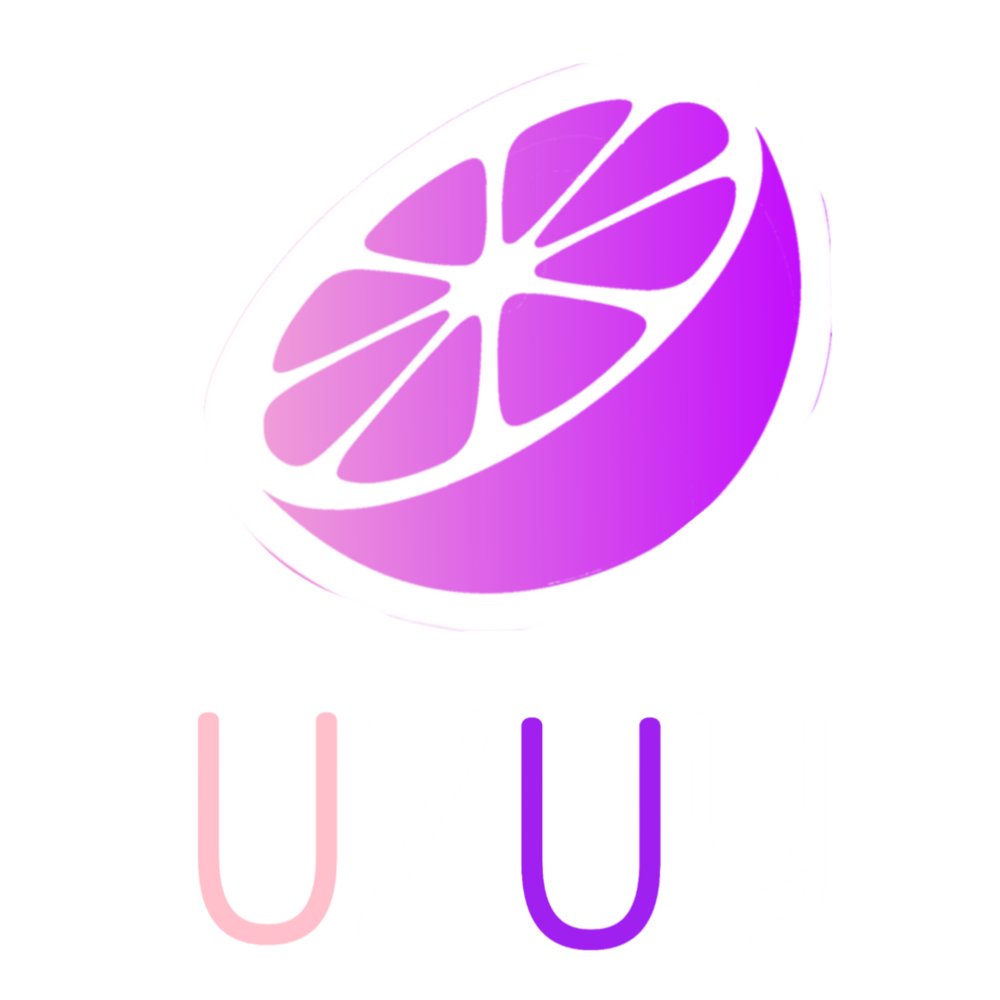

	  

<h1 align="center"><b>Uzuy Remastered</b>
 
<h4 align="center"><b>Uzuy Remastered</b> is an experimental and non-profit continuation to the famous Nintendo Switch emulator — Uzuy.
 
It is written in C++ and gives ultimate performance to every device — to low-end to high-end.
</h4>

# Drivers
- [Adreno](https://github.com/uzuy-emul/AdrenoDrivers)
- [Mali](https://github.com/uzuy-emul/MaliDrivers/tree/main)

# Screenshots
- Super Mario Bros: Wonder - Snapdragon 460

# Downloads
## MMJR
- Grab the latest Remastered Uzuy MMJR build from the official [Github Releases](https://github.com/uzuy-emul/uzuy/releases/tag/revision-v5) page.
## Edge
- Grab the latest Remastered Uzuy Edge build from the official [Github Releases](https://github.com/uzuy-emul/uzuy/releases/tag/revision-v5) page.
## Difference
- MMJR is based off Uzuy. It may give better performance.
- Edge is based off yuzu. It may give better performance on lowend devices.
----
If a pop up like the one below pops up click show more and install anyway or install without analyzing.
- **THIS IS BECAUSE OF THE PACKAGE NAME CHANGE!**

